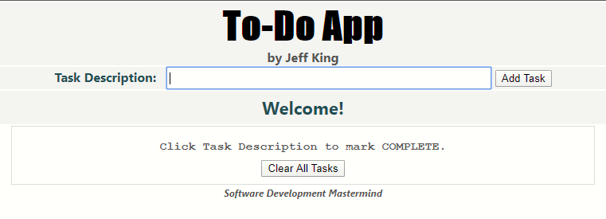
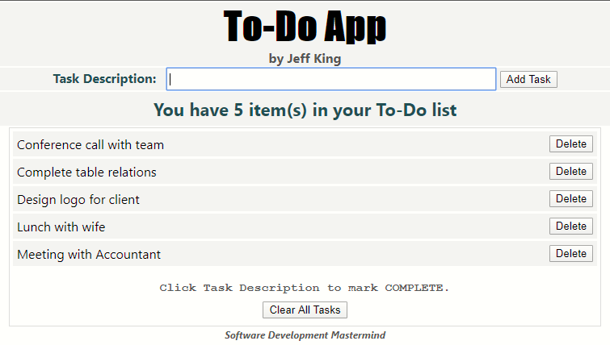

# JavaScript To-Do App
Written entirely in pure JavaScript, HTML, and CSS, an app to create a list of tasks to complete

## Links
[View Application](https://jazfunk.github.io/jk-to-do-app/)  
[View Repository](https://github.com/jazfunk/jk-to-do-app.git)

## Instructions
- Enter task description in text box  
- Click "Add Task" to add to list  
- Click description to mark complete
- Click "Delete" button to delete a completed item  
- Items not marked complete cannot be deleted.  
- All items will be saved locally, and avaialbe the next time you open the page  
- To clear all items listed and saved locally, click "Clear All Tasks"

## Application Images

* **No List Items** 
 

* **List items added** 
 

* **No List Items** 
 

* **List items added** 

## Summary
Seemingly a simple application to develop, the "To-Do" app was a challenging one.  Utilizing local browser storage to persist data between user visits has always been something I wanted to become proficient in.  With the skills developed from building this app, my understanding of local storage has improved tremendously.

## Author
* **Jeff King** - *Full Stack Software Developer* - [GitHub](https://github.com/jazfunk) | [LinkedIn](https://www.linkedin.com/in/jeffking222/)